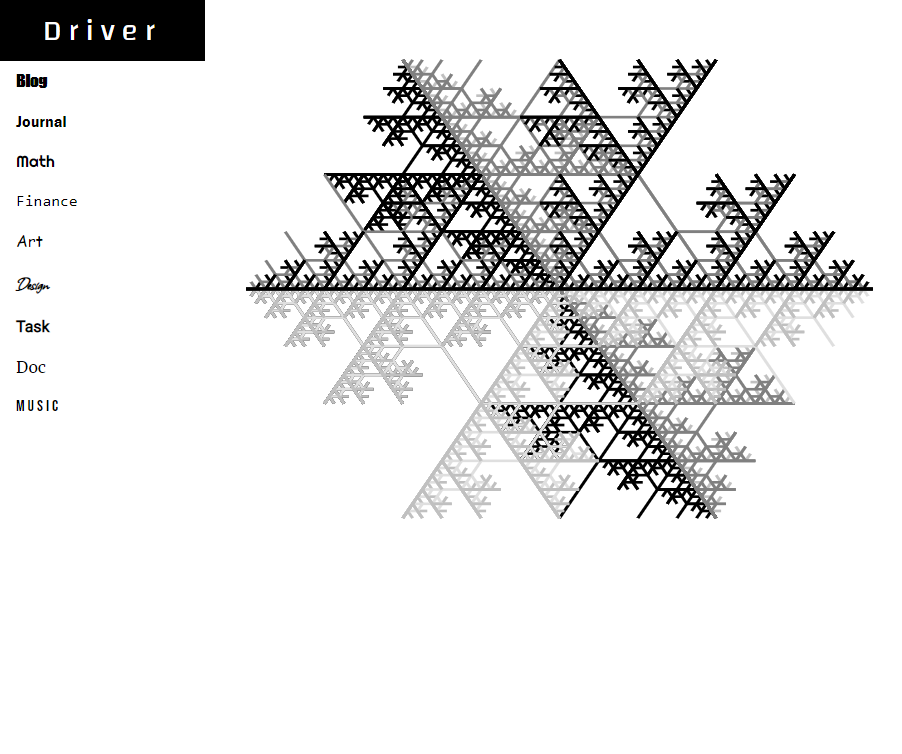

There's nothing quite like building your own applications on your free time to open up your mind to possibilities.  At work, I tend to stick to the same technologies and reenforce the same mentality day after day.  I *need* to develop my own stuff just to get me out of these mental ruts.

And, it never ceases to amaze me just how many areas of my life can benefit from just a little software development.  Over the years I've built out a small ecosystem of apps.  The apps were developed with different frameworks, technologies, and even a different mentality.  

## Driver

"Driver" is a play on a gamer tag I had years ago as "THE VanDriver" which itself was a play on my last name "Vandiver".  

## Portal

With the portal idea, I'd like to consolidate my personal applications into a cohesive user experience *even if* the technology backing each app is fundamentally different.  I don't have a particular goal (at the moment) other than to grow my development experience.

I'd like for each of the apps to be self-contained, to be able to drive their own technology, and to evolve independently.  

## Design

So, as usual, I prefer to start with design to get a picture of what I'll be building.  

Personally, I'm a fan of [Bootstrap](https://getbootstrap.com/).  I've used it for years at work ever since Bootstrap 2.0 way back in 2013.  I consider myself a developer who dabbles in design, so relying a design framework makes a lot of sense to me.

I generated the following fractal years ago, so I thought for now I'd throw it on the home page.

That's it!

You can checkout my progress on this portal here: https://github.com/joelvandiver/driver-portal 

