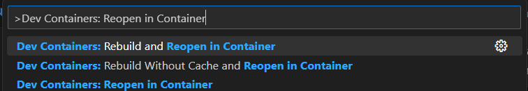

After you have completed the [dockerizing development](/guides/intro/dockerize-development/) setup, you can setup the python dev container:

> `.devcontainer/devcontainer.json`

```json
// For format details, see https://aka.ms/devcontainer.json. For config options, see the
// README at: https://github.com/devcontainers/templates/tree/main/src/python
{
	"name": "Python 3",
	// Or use a Dockerfile or Docker Compose file. More info: https://containers.dev/guide/dockerfile
	"image": "mcr.microsoft.com/devcontainers/python:0-3.11"

	// Features to add to the dev container. More info: https://containers.dev/features.
	// "features": {},

	// Use 'forwardPorts' to make a list of ports inside the container available locally.
	// "forwardPorts": [],

	// Use 'postCreateCommand' to run commands after the container is created.
	// "postCreateCommand": "pip3 install --user -r requirements.txt",

	// Configure tool-specific properties.
	// "customizations": {},

	// Uncomment to connect as root instead. More info: https://aka.ms/dev-containers-non-root.
	// "remoteUser": "root"
}
```

Select "Reopen in Container" from the command palette (CTRL+SHIFT+P):



Then, open a terminal and run the following commands:

```bash
vscode -> ../Guide/Python (main) $ python
Python 3.11.2 (main, Mar 23 2023, 17:12:29) [GCC 10.2.1 20210110] on linux
Type "help", "copyright", "credits" or "license" for more information.
>>> 3 + 3
6
```

Pretty sweet!