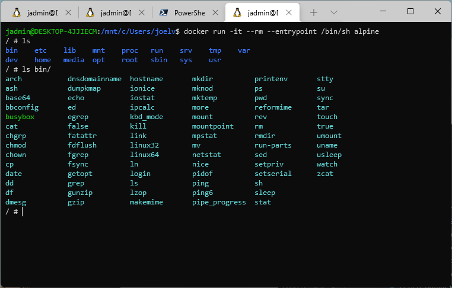
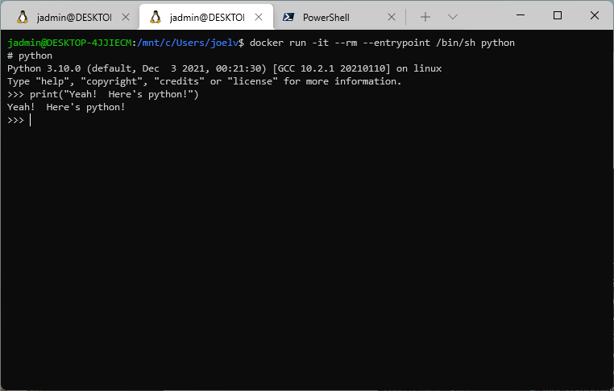
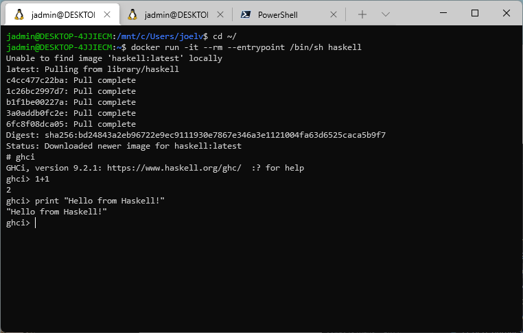

Docker is great for production use, but have you considered using it to quickly take out tools for a spin?  I find I'm reaching for the following command multiple times throughout the day.

> `docker run -it --rm --entrypoint /bin/sh $TOOL`

`$TOOL` can be whatever linux based tool I'm interested in trying out. Let's take out `alpine` linux for a spin.

> `docker run -it --rm --entrypoint /bin/sh alpine`

Or, I might spin up a `python` instance to take a look around Python.

> `docker run -it --rm --entrypoint /bin/sh python`

It's also great for other languages you might want to take out for a spin, such as:

> `docker run -it --rm --entrypoint /bin/sh haskell`

Pretty cool, eh?

