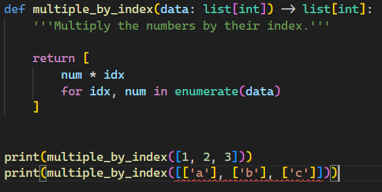

# Python Annotations

Python is great language to prototype ideas.  The dynamic runtime opens up some possibilities that are very difficult in statically typed languages.  

However, there's a catch:  the dynamic runtime should not come at the cost of poor code documentation.  Let's take this simple, arbitrary function:

```python
def transform(data):
    '''Transform this data.'''

    return [
        item * idx
        for idx, item in enumerate(data)
    ]
```

The `transform` function above is pretty straightforward.  It multiplies the numbers in the list by their index, right?  Let's take it out for a spin:

```python
print(transform([1, 2, 3]))
# [0, 2, 6]
```

Yep!  That's simple.  But, wait, what about this?

```python
print(transform([['a'], ['b'], ['c']]))
[[], ['b'], ['c', 'c']]
```

What's going on here?  Well, nothing in the function said to explicitly work with integers.  How would you restrict the types of inputs so that you can reason about the behavior more simply?  

Also, there's another problem:  the function signature doesn't inform you of it's behavior.  You have to **read** the function implementation to *know* what it does.  The function signature is the function name, it's arguments' names and types, and the return type.  We should be able to read the signature `def transform(data)` and know exactly what's going on.  This problem cannot be over-stated.

Enter Python type annotations!  

```python
def multiply_by_index(data: list[int]) -> list[int]:
    '''Multiply the numbers by their index.'''

    return [
        num * idx
        for idx, num in enumerate(data)
    ]
```

Now, the function signature is very informative:  `def multiply_by_index(data: list[int]) -> list[int]`.  And, the types are restricted at code-time:



Note that this restriction only applies while coding; the runtime still behaves the same:

```python
print(multiple_by_index([1, 2, 3]))
print(multiple_by_index([['a'], ['b'], ['c']]))
# [0, 2, 6]
# [[], ['b'], ['c', 'c']]
```

The runtime/code-time distinction might seem unhelpful, but I have experienced first-hand seeing the benefits of annotations in large codebases.  The clearer function signatures allow me to build up ever more complicated logic while ignoring the implementation details of the simpler functions.