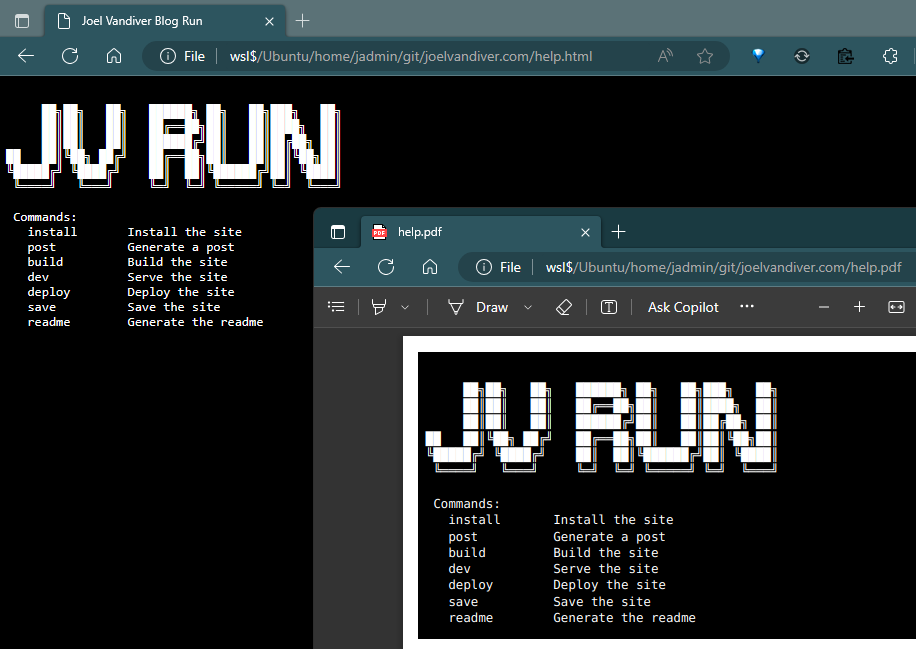

# Generate a CLI README

I find it useful sometimes to generate documentation directly from the CLI.

Let's setup a simple `readme` `bash` function.  I'll use a simple command I use for working on this blog:  `run help`.  The command could be anything that you want to generate help from.

```bash
readme() {
    cmd="run help"
    title="Run Help"

    html=help.html
    pdf=help.pdf

    # Install tools, if necessary.
    if ! command -v aha &> /dev/null
    then    
        echo "Installing aha"
        sudo apt install aha
    fi
    if ! command -v wkhtmltopdf &> /dev/null
    then    
        echo "Installing wkhtmltopdf"
        sudo apt install wkhtmltopdf
    fi

    # Generate the html from the command.
    script -qc "$cmd" /dev/null | aha --black --title "$title" > "$html"

    # Generate a pdf of the html file.
    wkhtmltopdf -s Letter "$html" "$pdf"
}
```




For a little fun, I usually like throw in a little ASCII art.  For this one, I used:  [Test ~330 fonts ASCII art generator | TextKool](https://textkool.com/en/test-ascii-art-generator?text=JV%20Blog%20Run)